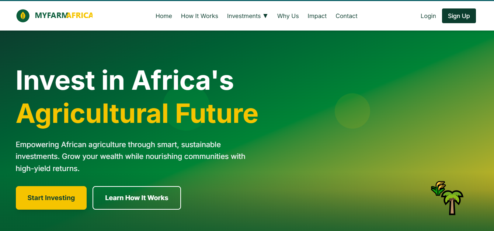
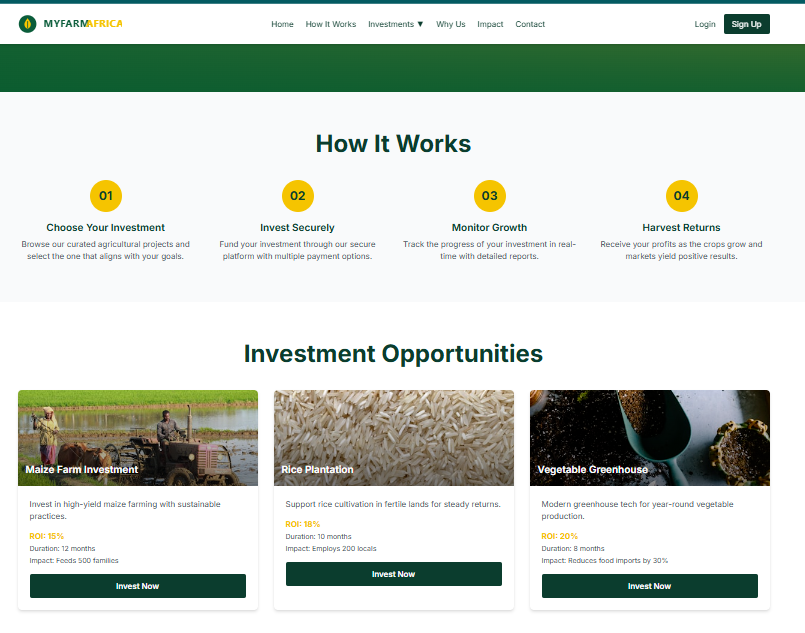
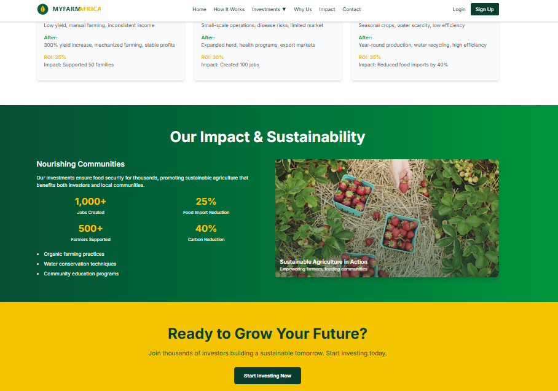

# MYFARM AFRICA 🌾

<p align="center">
  
</p>

<p align="center">
  A premium, production-ready AGROTECH investment platform built with React + Vite v4.<br>
  Empowering African agriculture through smart, sustainable investments.
</p>

<p align="center">
  
</p>

## 🚀 Live Demo

[View Live Platform](http://localhost:5175/) (when running locally)

## 📸 Screenshots

<p align="center">
  
  
  
</p>

## ✨ Features

### 🎯 Core Functionality

- **Investment Opportunities**: 12+ agricultural investment options with detailed ROI projections
- **User Authentication**: Secure signup/login with Google & Facebook integration
- **Investor Dashboard**: Real-time portfolio tracking with interactive charts
- **Detailed Investment Views**: Comprehensive project information with 12-month ROI graphs
- **Contact System**: Professional contact forms and information

### 🎨 Premium Design

- **Cinematic Hero Section**: Above-the-fold impact with agricultural landscape simulation
- **Image-Driven Cards**: High-quality investment opportunity displays
- **Glassmorphic Modals**: Modern modal designs with gradient backgrounds
- **Responsive Layout**: Mobile-first design that scales beautifully
- **Smooth Animations**: Framer Motion powered transitions and micro-interactions

### 🔒 Security & Trust

- **Form Validation**: Real-time validation with error states
- **Trust Signals**: 5,000+ investors, ₦500M+ invested, 50+ successful projects
- **Compliance**: Risk disclosures, privacy policy, terms & conditions
- **SSL Ready**: HTTPS-ready architecture

### 📊 Data Visualization

- **ROI Charts**: Interactive line charts showing investment growth
- **Performance Metrics**: Real-time investment tracking
- **Impact Statistics**: Community and environmental impact metrics

## 🛠️ Tech Stack

- **Frontend**: React 19 + Vite v4
- **Styling**: Tailwind CSS v4
- **Animations**: Framer Motion
- **Icons**: React Icons (FontAwesome)
- **Charts**: Recharts
- **State Management**: React Hooks
- **Routing**: React Router (future implementation)

## 📦 Installation

1. **Clone the repository**

   ```bash
   git clone https://github.com/omasleek/myfarm-africa.git
   cd myfarm-africa
   ```

2. **Install dependencies**

   ```bash
   npm install
   ```

3. **Start development server**

   ```bash
   npm run dev
   ```

4. **Build for production**
   ```bash
   npm run build
   ```

## 🏗️ Project Structure

```
myfarm-africa/
├── public/
│   └── vite.svg
├── src/
│   ├── assets/
│   ├── components/
│   │   ├── sections/          # Page sections
│   │   │   ├── Hero.jsx
│   │   │   ├── HowItWorks.jsx
│   │   │   ├── InvestmentOpportunities.jsx
│   │   │   ├── WhyUs.jsx
│   │   │   ├── SuccessStories.jsx
│   │   │   ├── Impact.jsx
│   │   │   └── CallToAction.jsx
│   │   ├── Header.jsx         # Navigation
│   │   ├── Footer.jsx         # Site footer
│   │   ├── Signup.jsx         # Authentication
│   │   ├── Login.jsx
│   │   ├── Dashboard.jsx      # Investor dashboard
│   │   ├── InvestmentModal.jsx
│   │   ├── DetailedInvestmentModal.jsx
│   │   └── ContactModal.jsx
│   ├── App.jsx                # Main app component
│   ├── main.jsx               # Entry point
│   └── index.css              # Global styles
├── index.html
├── vite.config.js
├── package.json
└── README.md
```

## 🎨 Design System

### Colors

- **Primary**: Dark Green (#0B3D2E) - Trust & Growth
- **Secondary**: White (#FFFFFF) - Clarity
- **Accent**: Yellow/Gold (#F5C400) - Prosperity & Returns

### Typography

- **Headlines**: Bold sans-serif (Inter)
- **Body**: Clean readable sans-serif
- **Hierarchy**: H1-H6 with proper contrast ratios

### Components

- **Cards**: Image-driven with hover effects
- **Buttons**: Gradient backgrounds with scale animations
- **Modals**: Glassmorphic with backdrop blur
- **Forms**: Validation states with error messaging


## 🤝 Contributing

1. Fork the repository
2. Create a feature branch (`git checkout -b feature/amazing-feature`)
3. Commit changes (`git commit -m 'Add amazing feature'`)
4. Push to branch (`git push origin feature/amazing-feature`)
5. Open a Pull Request

## 📄 License

This project is licensed under the MIT License - see the [LICENSE](LICENSE) file for details.

## 🙏 Acknowledgments

- **Images**: Unsplash for high-quality agricultural photography
- **Icons**: React Icons for consistent iconography
- **Charts**: Recharts for data visualization
- **Animations**: Framer Motion for smooth interactions

## 📞 Contact

**MYFARM AFRICA**

- Email: omachilda.dev@gmail.com
- Built by: omachilda

---

_Empowering African agriculture through smart, sustainable investments. 🌱_
